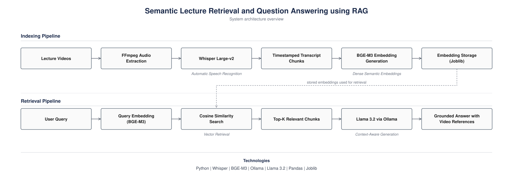

# 🎓 Semantic Lecture Retrieval and Question Answering using RAG

A Retrieval-Augmented Generation (RAG) system that transforms lecture videos into a searchable knowledge repository by combining automatic speech recognition, semantic retrieval, and large language models to enable context-aware question answering over educational content.


---

## Motivation

The rapid growth of recorded educational content has created a significant information retrieval challenge for learners. While lecture videos contain valuable knowledge, locating specific concepts within hours of recordings remains inefficient and often requires extensive manual navigation. Traditional keyword-based search methods are limited in their ability to understand semantic meaning and contextual relationships within educational material.

This project explores how Retrieval-Augmented Generation (RAG) can be applied to educational knowledge retrieval by converting lecture recordings into a structured semantic knowledge base. The goal is to enable natural-language interaction with course content while ensuring that generated responses remain grounded in the original source material.


## Proposed Approach

The system follows a Retrieval-Augmented Generation (RAG) pipeline that combines automatic speech recognition, semantic retrieval, and large language models to enable question answering over lecture content. Lecture videos are first converted into audio files and transcribed into text using Whisper. The generated transcripts are segmented into timestamped chunks and transformed into vector embeddings using the BGE-M3 embedding model. During inference, user queries are embedded into the same vector space and matched against the stored transcript embeddings using cosine similarity. The most relevant content is then supplied to Llama 3.2 through Ollama, enabling the model to generate responses grounded in the retrieved lecture material.

This retrieval-based framework helps reduce hallucinations while improving the relevance and contextual accuracy of generated answers.


## Key Contributions

- Developed an end-to-end Retrieval-Augmented Generation (RAG) pipeline for educational content.
- Implemented automatic lecture transcription using Whisper.
- Built a semantic retrieval system using BGE-M3 embeddings and cosine similarity.
- Integrated retrieval-augmented context grounding with Llama 3.2.
- Enabled timestamp-aware question answering over lecture videos.
- Designed a reusable workflow capable of processing arbitrary educational video collections.


## Technical Stack

| Component | Technology |
|------------|------------|
| Programming Language | Python |
| Automatic Speech Recognition | Whisper (Large-v2) |
| Embedding Model | BGE-M3 |
| Retrieval Method | Cosine Similarity |
| Large Language Model | Llama 3.2 |
| Inference Platform | Ollama |
| Data Processing | Pandas, NumPy |
| Embedding Storage | Joblib |
| Multimedia Processing | FFmpeg |


## System Architecture

The following diagram illustrates the indexing and retrieval pipelines of the proposed Retrieval-Augmented Generation (RAG) system.

<p align="center">
  
</p>


## System Workflow

The project follows a multi-stage pipeline in which each component builds upon the output generated by the previous stage. Starting from raw lecture videos, the system progressively transforms unstructured multimedia content into a searchable semantic knowledge base capable of supporting context-aware question answering.

```text
Lecture Videos
      │
      ▼
Video to Audio Conversion
      │
      ▼
Whisper Transcription
      │
      ▼
Timestamped JSON Chunks
      │
      ▼
Embedding Generation (BGE-M3)
      │
      ▼
Embedding Storage (Joblib)
      │
      ▼
Semantic Retrieval
      │
      ▼
Llama 3.2 Inference
      │
      ▼
Generated Response

```

## Demonstration

The following example demonstrates how the system retrieves relevant lecture content and generates grounded responses.

### User Question

> CSS

### Retrieved Information

- Video Number: 8
- Relevant Timestamp: 54.64s – 80.96s
- Topic: Introduction to CSS

### Generated Response

CSS (Cascading Style Sheets) is a stylesheet language used to control the appearance and layout of web pages. It allows developers to define colors, fonts, spacing, positioning, and other visual aspects of HTML elements, helping create attractive and responsive websites.

The topic is covered in **Video 8: "Mastering CSS Inline, Internal and External Stylesheets"**.

**Relevant timestamps:**
- 54.64s – 56.64s: Introduction to CSS
- 78.96s – 80.96s: Explanation of what CSS is

These sections introduce the purpose of CSS and how it is used to style web pages. For a better understanding, it is recommended to watch the referenced portions of the lecture.

### System Output Features

- Semantic retrieval of relevant lecture segments
- Timestamp-aware references
- Context-grounded answer generation
- Reduced hallucination through retrieval augmentation


## Implementation Pipeline

* Follow the pipeline in the specified order, as each step depends on the output generated by the previous step.
* Large input files and generated artifacts (e.g., video files, audio files, JSON chunks, and embeddings) are excluded from this repository to keep it lightweight and manageable.
* All excluded artifacts can be regenerated by executing the pipeline from the beginning using your own data.
* Before running the project, ensure that the required directories and source files are present and properly configured.


### Step 1: Prepare Input Videos
transfer all your video files in the video folder file

### Step 2: Audio Extraction

use video_to_mp3 file to convert all video files to .mp3(audio) files

### Step 3: Transcript Generation

make all chunks of .mp3 files as a json files with mp3_to_json file

### Step 4: Embedding Generation

The generated transcript chunks are converted into dense vector embeddings using the BGE-M3 embedding model. These embeddings are stored in a Joblib-based data structure and later used for semantic retrieval during inference.

### Step 5: Retrieval and Response Generation 

use process_query file to read the joblib file and loaded into the memory . Then give the prompt as per the user input to get the desire output as needed from this model and feed it to the LLM.


## Future Research Directions

This project serves as a foundation for exploring more advanced retrieval and question-answering systems. Several potential directions for future work include:

- Hybrid dense-sparse retrieval mechanisms for improved search accuracy.
- Integration with dedicated vector databases such as FAISS, ChromaDB, or Qdrant.
- Multi-document and cross-lecture reasoning across entire course collections.
- Citation-aware answer generation to improve traceability and transparency.
- Comparative evaluation of embedding models for educational content retrieval.
- Multilingual question answering over lecture recordings.
- Quantitative evaluation using retrieval metrics such as Recall@K and Mean Reciprocal Rank (MRR).
- Investigation of hallucination reduction techniques in Retrieval-Augmented Generation systems.